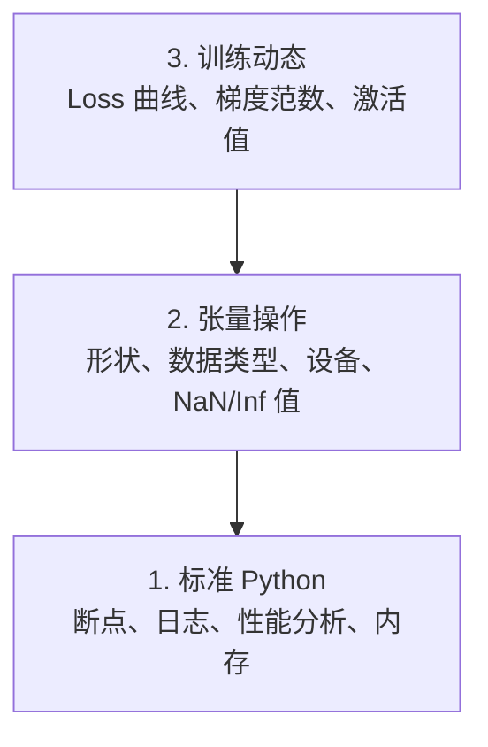

# 调试与性能分析

> 最糟糕的 AI bug 不会崩溃。它们在垃圾数据上安静地训练，然后报告一条漂亮的 loss 曲线。

**类型：** 构建
**语言：** Python
**前置条件：** Lesson 1（环境配置），基本的 PyTorch 熟悉度
**时间：** 约 60 分钟

## 学习目标

- 使用条件 `breakpoint()` 和 `debug_print` 在训练中检查张量形状、数据类型和 NaN 值
- 使用 `cProfile`、`line_profiler` 和 `tracemalloc` 分析训练循环，找到瓶颈
- 检测常见的 AI bug：形状不匹配、NaN loss、数据泄露和错误设备上的张量
- 设置 TensorBoard 可视化 loss 曲线、权重直方图和梯度分布

## 问题

AI 代码的失败方式与普通代码不同。Web 应用崩溃会有堆栈跟踪。配置错误的训练循环运行 8 小时，烧掉 $200 的 GPU 时间，产生一个预测每个输入均值的模型。代码从不报错。bug 是一个在错误设备上的张量、一个被遗忘的 `.detach()`，或者标签泄露到了特征中。

你需要调试工具，在这些静默故障浪费你的时间和算力之前捕获它们。

## 概念

AI 调试在三个层次上运行：



大多数人直接跳到第 3 层（盯着 TensorBoard 看）。但 80% 的 AI bug 在第 1 层和第 2 层。

## 构建

### 第 1 部分：打印调试（是的，它有效）

打印调试被轻视了。它不应该被轻视。对于张量代码，有针对性的 print 语句比单步调试器更好，因为你需要同时看到形状、数据类型和值范围。

```python
def debug_print(name, tensor):
    print(f"{name}: shape={tensor.shape}, dtype={tensor.dtype}, "
          f"device={tensor.device}, "
          f"min={tensor.min().item():.4f}, max={tensor.max().item():.4f}, "
          f"mean={tensor.mean().item():.4f}, "
          f"has_nan={tensor.isnan().any().item()}")
```

在每个可疑操作后调用这个函数。找到 bug 后删除 print 语句。简单。

### 第 2 部分：Python 调试器（pdb 和 breakpoint）

内置调试器在 AI 工作中被低估了。在训练循环中放入 `breakpoint()`，交互式检查张量。

```python
def training_step(model, batch, criterion, optimizer):
    inputs, labels = batch
    outputs = model(inputs)
    loss = criterion(outputs, labels)

    if loss.item() > 100 or torch.isnan(loss):
        breakpoint()

    loss.backward()
    optimizer.step()
```

当调试器启动时，有用的命令：

- `p outputs.shape` 检查形状
- `p loss.item()` 查看 loss 值
- `p torch.isnan(outputs).sum()` 计算 NaN 数量
- `p model.fc1.weight.grad` 检查梯度
- `c` 继续，`q` 退出

这是条件调试。只在有问题时才停止。对于 10,000 步的训练运行，这很重要。

### 第 3 部分：Python 日志

当调试超出快速检查时，用日志替换 print 语句。

```python
import logging

logging.basicConfig(
    level=logging.INFO,
    format="%(asctime)s [%(levelname)s] %(message)s",
    handlers=[
        logging.FileHandler("training.log"),
        logging.StreamHandler()
    ]
)
logger = logging.getLogger(__name__)

logger.info("开始训练: lr=%.4f, batch_size=%d", lr, batch_size)
logger.warning("检测到 loss 尖峰: %.4f 在第 %d 步", loss.item(), step)
logger.error("NaN loss 在第 %d 步，停止", step)
```

日志给你时间戳、严重级别和文件输出。当训练在凌晨 3 点失败时，你需要日志文件，而不是滚出屏幕的终端输出。

### 第 4 部分：计时代码段

知道时间花在哪里是优化的第一步。

```python
import time

class Timer:
    def __init__(self, name=""):
        self.name = name

    def __enter__(self):
        self.start = time.perf_counter()
        return self

    def __exit__(self, *args):
        elapsed = time.perf_counter() - self.start
        print(f"[{self.name}] {elapsed:.4f}s")

with Timer("数据加载"):
    batch = next(dataloader_iter)

with Timer("前向传播"):
    outputs = model(batch)

with Timer("反向传播"):
    loss.backward()
```

常见发现：数据加载占训练时间的 60%。解决方法是 DataLoader 中 `num_workers > 0`，而不是更快的 GPU。

### 第 5 部分：cProfile 和 line_profiler

当你需要比手动计时器更多时：

```bash
python -m cProfile -s cumtime train.py
```

这显示按累计时间排序的每个函数调用。逐行分析：

```bash
pip install line_profiler
```

```python
@profile
def train_step(model, data, target):
    output = model(data)
    loss = F.cross_entropy(output, target)
    loss.backward()
    return loss

# 运行：kernprof -l -v train.py
```

### 第 6 部分：内存分析

#### CPU 内存（tracemalloc）

```python
import tracemalloc

tracemalloc.start()

# 你的代码
model = build_model()
data = load_dataset()

snapshot = tracemalloc.take_snapshot()
top_stats = snapshot.statistics("lineno")
for stat in top_stats[:10]:
    print(stat)
```

#### CPU 内存（memory_profiler）

```bash
pip install memory_profiler
```

```python
from memory_profiler import profile

@profile
def load_data():
    raw = read_csv("data.csv")       # 观察这里内存跳增
    processed = preprocess(raw)       # 这里也是
    return processed
```

运行 `python -m memory_profiler your_script.py` 查看逐行内存使用。

#### GPU 内存（PyTorch）

```python
import torch

if torch.cuda.is_available():
    print(torch.cuda.memory_summary())

    print(f"已分配: {torch.cuda.memory_allocated() / 1e9:.2f} GB")
    print(f"已缓存: {torch.cuda.memory_reserved() / 1e9:.2f} GB")
```

当你遇到 OOM（内存不足）时：

1. 减小 batch size（首先尝试，总是有效）
2. 使用 `torch.cuda.empty_cache()` 释放缓存内存
3. 对于大型中间变量，使用 `del tensor` 然后 `torch.cuda.empty_cache()`
4. 使用混合精度 (`torch.cuda.amp`) 将内存减半
5. 对于非常深的模型，使用梯度检查点

### 第 7 部分：常见 AI Bug 及如何捕获

#### 形状不匹配

最常见的 bug。张量形状为 `[batch, features]`，而模型期望 `[batch, channels, height, width]`。

```python
def check_shapes(model, sample_input):
    print(f"输入: {sample_input.shape}")
    hooks = []

    def make_hook(name):
        def hook(module, inp, out):
            in_shape = inp[0].shape if isinstance(inp, tuple) else inp.shape
            out_shape = out.shape if hasattr(out, "shape") else type(out)
            print(f"  {name}: {in_shape} -> {out_shape}")
        return hook

    for name, module in model.named_modules():
        hooks.append(module.register_forward_hook(make_hook(name)))

    with torch.no_grad():
        model(sample_input)

    for h in hooks:
        h.remove()
```

用一个样本 batch 运行一次。它会映射模型中的每个形状变换。

#### NaN Loss

NaN loss 意味着某些东西爆炸了。常见原因：

- 学习率太高
- 自定义 loss 中除以零
- 对零或负数取对数
- RNN 中的梯度爆炸

```python
def detect_nan(model, loss, step):
    if torch.isnan(loss):
        print(f"NaN loss 在第 {step} 步")
        for name, param in model.named_parameters():
            if param.grad is not None:
                if torch.isnan(param.grad).any():
                    print(f"  NaN 梯度在 {name}")
                if torch.isinf(param.grad).any():
                    print(f"  Inf 梯度在 {name}")
        return True
    return False
```

#### 数据泄露

你的模型在测试集上达到 99% 准确率。听起来很棒。这是个 bug。

```python
def check_data_leakage(train_set, test_set, id_column="id"):
    train_ids = set(train_set[id_column].tolist())
    test_ids = set(test_set[id_column].tolist())
    overlap = train_ids & test_ids
    if overlap:
        print(f"数据泄露: {len(overlap)} 个样本同时在训练集和测试集中")
        return True
    return False
```

还要检查时间泄露：用未来数据预测过去。划分前按时间戳排序。

#### 错误设备

不同设备上的张量（CPU vs GPU）会导致运行时错误。但有时一个张量静默地留在 CPU 上，而其他所有东西都在 GPU 上，训练只是运行得很慢。

```python
def check_devices(model, *tensors):
    model_device = next(model.parameters()).device
    print(f"模型设备: {model_device}")
    for i, t in enumerate(tensors):
        if t.device != model_device:
            print(f"  警告: 张量 {i} 在 {t.device}，模型在 {model_device}")
```

### 第 8 部分：TensorBoard 基础

TensorBoard 显示训练过程中发生的事情。

```bash
pip install tensorboard
```

```python
from torch.utils.tensorboard import SummaryWriter

writer = SummaryWriter("runs/experiment_1")

for step in range(num_steps):
    loss = train_step(model, batch)

    writer.add_scalar("loss/train", loss.item(), step)
    writer.add_scalar("lr", optimizer.param_groups[0]["lr"], step)

    if step % 100 == 0:
        for name, param in model.named_parameters():
            writer.add_histogram(f"weights/{name}", param, step)
            if param.grad is not None:
                writer.add_histogram(f"grads/{name}", param.grad, step)

writer.close()
```

启动：

```bash
tensorboard --logdir=runs
```

观察什么：

- **Loss 不下降**：学习率太低，或模型架构问题
- **Loss 剧烈振荡**：学习率太高
- **Loss 变成 NaN**：数值不稳定（见上面 NaN 部分）
- **训练 loss 下降，验证 loss 上升**：过拟合
- **权重直方图坍缩到零**：梯度消失
- **梯度直方图爆炸**：需要梯度裁剪

### 第 9 部分：VS Code 调试器

对于交互式调试，配置 VS Code 的 `launch.json`：

```json
{
    "version": "0.2.0",
    "configurations": [
        {
            "name": "调试训练",
            "type": "debugpy",
            "request": "launch",
            "program": "${file}",
            "console": "integratedTerminal",
            "justMyCode": false
        }
    ]
}
```

点击行号左侧设置断点。使用变量面板检查张量属性。调试控制台让你在执行中途运行任意 Python 表达式。

对于逐步查看数据预处理管道中的每个变换很有用。

## 使用

以下是捕获大多数 AI bug 的调试工作流：

1. **训练前**：用样本 batch 运行 `check_shapes`。验证输入和输出维度符合预期。
2. **前 10 步**：对 loss、输出和梯度使用 `debug_print`。确认没有 NaN，值在合理范围内。
3. **训练中**：记录 loss、学习率和梯度范数。使用 TensorBoard 可视化。
4. **出问题时**：在故障点放入 `breakpoint()`。交互式检查张量。
5. **性能优化**：计时数据加载 vs 前向 vs 反向传播。如果接近 OOM，分析内存。

## 输出

运行调试工具脚本：

```bash
python phases/00-setup-and-tooling/12-debugging-and-profiling/code/debug_tools.py
```

查看 `outputs/prompt-debug-ai-code.md` 获取帮助诊断 AI 特定 bug 的提示。

## 练习

1. 运行 `debug_tools.py` 并阅读每部分的输出。修改虚拟模型引入 NaN（提示：在前向传播中除以零）并观察检测器捕获它。
2. 用 `cProfile` 分析训练循环，找出最慢的函数。
3. 用 `tracemalloc` 找出数据加载管道中哪一行分配最多内存。
4. 为简单训练运行设置 TensorBoard，判断模型是否过拟合。
5. 在训练循环中使用 `breakpoint()`。练习从调试器提示符检查张量形状、设备和梯度值。
